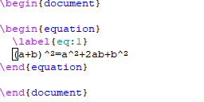
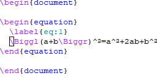
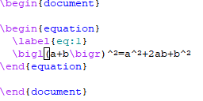
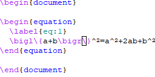

# bratex
Emacs package for manipulation of brackets in LaTeX mode

If you dislike the `\left` and `\right` macros in LaTeX, you are not alone!
Quoting from the manual of the [amsmath](https://ctan.org/pkg/amsmath) package
(see section 4.14.1):

> The automatic delimiter sizing done by \left and \right has two limitations:
> First, it is applied mechanically to produce delimiters large enough to
> encompass the largest contained item, and second, the range of sizes is not
> even approximately continuous but has fairly large quantum jumps.

You might prefer manual sizing through the size modifiers: `\big`, `\Big`,
`\bigg` and `\Bigg`, or even better (this requires `amsmath`): `\bigl...\bigr`,
`\Bigl...\Bigr`, `\biggl...\biggr` and `\Biggl...\Biggr`. But then, resizing
becomes painful: you need to move to the opening delimiter, change its size
modifier, then move to the closing delimiter, and do the same.

Introducing `bratex`, that defines functions to automatically cycle through size
delimiters.

## Getting started

A picture is worth a thousand words… So the four major functions defined in the
`bratex` package are illustrated below.

### Cycling through the delimiter sizes

| `bratex-cycle-size` (<kbd>S-up</kbd>)              | `bratex-cycle-size-reverse` (<kbd>S-down</kbd>)                    |
| -------------------------------------------------- | -------------------------------------------------------------------|
|  |  |

### Cycling through the delimiter types

| `bratex-cycle-bracket` (<kbd>S-right</kbd>)              | `bratex-cycle-bracket-reverse` (<kbd>S-left</kbd>)                       |
| -------------------------------------------------------- | ------------------------------------------------------------------------ |
|  |  |

## Installation

For the time being, `package-install` is not enabled (contributions
welcome!).

Checkout the current repository, and place the file `bratex.el`
somewhere in your `load-path`.

### Configuration with the default `latex-mode`

Add the following lines to your `init.el` file

```
(require 'bratex)
(add-hook 'latex-mode-hook #'bratex-config)
```

### Configuration with AUCTeX

Add the following lines to your `init.el` file

```
(require 'bratex)
(add-hook 'LaTeX-mode-hook #'bratex-config)
```
